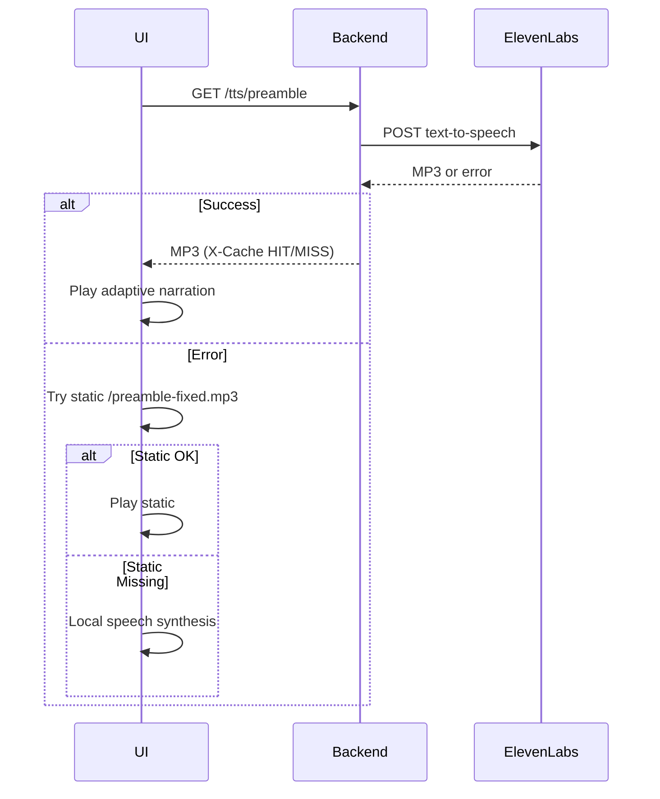
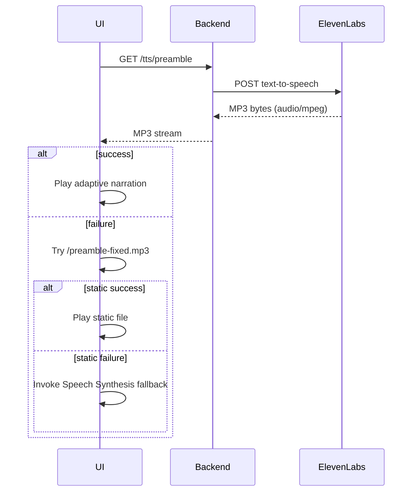

<div align="center">
<h1>Adaptive Interview & EQ Analytics Prototype</h1>
<strong>Sovereign, secure, and resilient adaptive interview platform (React + Vite + FastAPI).</strong>
</div>

## Core Feature Set

- Immersive Tron‑style animated UI (particle + circuit layers)
- Multi‑tier preamble narration (TTS → Static MP3 → Local Speech Synthesis)
- Adaptive questions & real‑time coaching feedback
- EQ, sentiment & emotion metric plugins (extensible analytics architecture)
- Archetype alignment & role-fit descriptive hints
- Summary export (CSV, JSON, PDF via lazy loaded jsPDF)
- Robust fallback and error boundary handling
- Caching + rate limiting on TTS route (cost & abuse mitigation)
- Test suite covering onboarding, flows, fallbacks, analytics edge cases
- Environment-driven behavior (preamble mode, origins, rate limits, TTL)

## Quick Start (Dev)

Backend (FastAPI):
```powershell
python -m venv .venv
./.venv/Scripts/Activate.ps1
pip install fastapi uvicorn httpx
$env:ELEVENLABS_API_KEY="YOUR_KEY"   # optional for TTS
python backend/main.py
```

Frontend (Vite React):
```powershell
npm install
npm run dev
```
Then open http://localhost:5173 (default Vite port). Backend defaults to http://127.0.0.1:8000

### Environment Bootstrap

Copy the provided example to start:
```powershell
Copy-Item .env.example .env -Force
```
Adjust `ALLOWED_ORIGINS` (comma separated) and optional `ELEVENLABS_API_KEY`. Restart the backend after edits.

## Environment Variables (Frontend & Backend)

| Variable | Scope | Default | Purpose |
|----------|-------|---------|---------|
| VITE_PREAMBLE_MODE | Frontend | auto | Force narration path: `auto`, `static`, `tts` |
| ALLOWED_ORIGINS | Backend | localhost variants | Comma list of allowed origins for CORS |
| ELEVENLABS_API_KEY | Backend | (none) | Enables TTS synthesis proxy |
| ELEVENLABS_VOICE_ID | Backend | EXAMPLE_VOICE_ID | Voice selection for ElevenLabs |
| ELEVENLABS_MODEL_ID | Backend | eleven_monolingual_v1 | Model id for TTS |
| TTS_PREAMBLE_TTL | Backend | 21600 | Cache lifetime (seconds) for synthesized MP3 |
| TTS_RATE_WINDOW_SEC | Backend | 60 | Sliding window duration for rate limiter |
| TTS_RATE_MAX | Backend | 5 | Max TTS requests per IP per window |
| LOG_LEVEL | Backend | INFO | Logging threshold (DEBUG, INFO, WARN, ERROR) |

## Preamble Fallback Architecture

1. Attempt dynamic TTS via `/tts/preamble` (cached by content hash + TTL)
2. If network / upstream failure: load static `/preamble-fixed.mp3`
3. If static also fails: adaptive local Speech Synthesis phrases with randomized pitch/rate
4. Test environment short‑circuits to immediate "Start" button (deterministic).

Automated tests (`preambleFallbacks.test.tsx`) validate failure cascades.

Mermaid sequence (abbreviated):


## Analytics Architecture

Plugins register with `analytics.registerPlugin(plugin)` and expose:
- `computeMetrics(data) => Metric[]`
- `visualize(metrics) => ReactNode`
- `exportData(metrics, format)` (optional)

Current plugins:
- `eqScorePlugin` – Average EQ
- `sentimentEmotionPlugin` – Positive sentiment %, emotion diversity, average emotion intensity

Edge case tests (`analyticsEdgeCases.test.tsx`) ensure robust handling of:
- Empty arrays
- Missing / partial fields
- Consistent calculations for sentiment proportion and emotion diversity

## Performance Optimizations

- Manual code splitting (`react-vendor`, `pdf` chunks) via Vite Rollup `manualChunks`
- Lazy dynamic import of `jspdf` inside export handler
- In-memory TTS audio caching (6h TTL configurable)
- Only one preamble MP3 asset retained (deduplicated)

## Security & Resilience

| Control | Status | Notes |
|---------|--------|-------|
| CORS Allowlist | Enabled | `ALLOWED_ORIGINS` parsed (no wildcard in prod) |
| TTS Rate Limiting | Enabled | Sliding window (env configurable) |
| API Key Exposure | Mitigated | Keys only server-side; no frontend leakage |
| Fallback Narration | Tested | Multi-tier path verified via automated tests |
| Error Boundary | Implemented | Global UI crash isolation |
| Audio Asset Hygiene | Done | Duplicates removed; single canonical file |
| Logging | Added | JSON lines via `logging_utils.py` |
| Request ID Tracing | Added | `X-Request-ID` middleware + log correlation |
| Security Headers | Added | CSP, HSTS, X-Frame-Options, Referrer, etc. |
| Health Endpoint | Added | `/health` liveness (fast, no deps) |
| Readiness Endpoint | Added | `/ready` includes cache/meta checks |
| Rate Limit Headers | Added | `X-RateLimit-*` + `Retry-After` on 429 |
| Basic Metrics | Added | `/metrics` in-process counters (prototype) |
| Optional Redis | Added | Distributed rate limiting & cache if `REDIS_URL` set |

Recommended next (optional hardening): persistent cache store, structured request IDs, external log aggregation.

## Logging

Backend logs JSON lines (stdout):
```json
{"ts":"2025-09-25T01:10:00Z","level":"INFO","msg":"tts_preamble cache miss","cache":"MISS","bytes":12345}
{"ts":"2025-09-25T01:10:05Z","level":"INFO","msg":"tts_preamble cache hit","cache":"HIT"}
{"ts":"2025-09-25T01:10:07Z","level":"INFO","msg":"next_question","sentiment":"Positive","eq":22,"derived":"What achievement are you most proud of?"}
```
Adjust verbosity: `LOG_LEVEL=DEBUG`.

### Centralized Configuration
Runtime environment variables are now loaded via `backend/config.py` (Pydantic `Settings`). This provides validation, defaults, and a single import point. Key fields:
```
allowed_origins, tts_rate_window_sec, tts_rate_max, tts_cache_ttl,
log_level, hsts_enabled, app_version, commit, build_time
```
Override any by setting corresponding environment variables (see `.env.example`).

### Version Endpoint
`GET /version` returns JSON including:
```
{
	"app": "EQ Adaptive Interview",
	"version": "0.1.0",
	"commit": "<hash or unknown>",
	"build_time": "<timestamp>",
	"request_id": "<X-Request-ID>"
}
```
Inject `APP_VERSION`, `APP_COMMIT`, and `APP_BUILD_TIME` during your CI/CD build for traceability.

### Request ID Tracing
Every inbound request is assigned (or preserves) an `X-Request-ID` header. Returned in the response and injected into structured logs (`request_id` field). This enables:
- Correlating frontend errors or HAR captures to backend log lines
- Tracing multi-call flows (e.g. preamble → adaptive question fetch)

Client usage example (fetch):
```ts
fetch('/tts/preamble', { headers: { 'X-Request-ID': crypto.randomUUID() }})
	.then(r => console.log('Trace ID:', r.headers.get('X-Request-ID')));
```

### Rate Limiting Headers
The TTS preamble endpoint returns standard style headers:
| Header | Meaning |
|--------|---------|
| `X-RateLimit-Limit` | Max requests allowed per window |
| `X-RateLimit-Remaining` | Requests left in current window |
| `X-RateLimit-Reset` | Epoch seconds when window resets |
| `Retry-After` | Seconds to wait (only on 429) |
| `X-Cache` | `HIT` or `MISS` for synthesized audio cache |

### Health & Readiness Probes
| Endpoint | Purpose | Typical Use |
|----------|---------|-------------|
| `GET /health` | Liveness: returns JSON `{status:"ok"}` quickly | K8s livenessProbe, uptime checks |
| `GET /ready` | Readiness: includes cache size & feature flags | K8s readinessProbe, deploy gates |

Example:
```powershell
curl http://localhost:8000/health
curl http://localhost:8000/ready
```

### Security Headers
Middleware injects:
| Header | Value (example) | Rationale |
|--------|------------------|-----------|
| `Content-Security-Policy` | `default-src 'self'; img-src 'self' data:; media-src 'self' data:;` | Mitigate XSS / rogue asset loads |
| `Strict-Transport-Security` | `max-age=63072000; includeSubDomains` | Enforce HTTPS (prod) |
| `X-Content-Type-Options` | `nosniff` | Prevent MIME sniffing |
| `Referrer-Policy` | `strict-origin-when-cross-origin` | Limit referrer leakage |
| `X-Frame-Options` | `DENY` | Clickjacking defense |
| `Permissions-Policy` | `camera=(), microphone=(), geolocation=()` | Limit powerful APIs |

If running behind a proxy/edge that sets overlapping headers, ensure they match or disable duplicates.

### Operational Verification (Pre-Deploy Checklist)
1. All tests green: `npm test --silent`
2. Preamble TTS cache seeded (optional): `curl -I http://localhost:8000/tts/preamble`
3. Security headers present: `curl -I http://localhost:8000/health`
4. Rate limit headers visible: check `curl -I` to `/tts/preamble` (repeat until `X-RateLimit-Remaining` decrements)
5. Request ID round-trip: `curl -H "X-Request-ID: demo-123" -I http://localhost:8000/health` and verify echo
6. Build passes: `npm run build` (ensure `dist/` produced)
7. No accidental large assets: inspect `dist/` (single preamble mp3 only)
8. Review logs for errors on startup (none expected beyond initial cache MISS)
9. (Optional) Verify metrics: `curl http://localhost:8000/metrics` (counters should increment after requests)

### Failure Modes & Mitigations
| Scenario | Symptom | Mitigation |
|----------|---------|------------|
| Cache pressure | Growing memory use | Introduce LRU eviction / Redis |
| High TTS latency | User waits for audio | Serve stale cached HIT while refreshing async |
| Missing Request IDs | External client omitted | Middleware auto-generates deterministic ID |
| Absent headers in tests | Backend not running | Tests skip gracefully (see `requestIdAndRateLimit.test.ts`) |

## Deployment Guide

1. Build frontend:
	 ```powershell
	 npm run build
	 ```
2. Serve `dist/` via static host (e.g. Nginx, Vercel static, S3 + CDN).
3. Run backend (example systemd / container):
	 ```bash
	 uvicorn backend.main:app --host 0.0.0.0 --port 8000
	 ```
4. Set `ALLOWED_ORIGINS` to production origin(s) (comma separated).
5. Provide TTS env vars if adaptive voice is required; else system gracefully uses static / synthesis.
6. Monitor logs for `WARN` / `ERROR` events (cache misses are normal on cold start).
7. (If Redis enabled) Confirm `X-RateLimit-Backend: redis` on `/tts/preamble` response headers.

### Health Checks
Prefer `GET /health` (liveness) and `GET /ready` (readiness). Root `/` still returns a basic status message for legacy clients.

### Containerized Deployment (Docker / Compose)

Build images manually:
```powershell
docker build -f backend/Dockerfile -t eq-backend .
docker build -f frontend.Dockerfile -t eq-frontend .
```
Run (detached):
```powershell
docker run -p 8000:8000 --env-file .env eq-backend
docker run -p 5173:80 eq-frontend
```
Using docker-compose (preferred for local):
```powershell
docker compose --env-file .env up -d --build
```
Visit: http://localhost:5173

If enabling Redis for shared rate limiting + cache, extend `docker-compose.yml`:
```yaml
	redis:
		image: redis:7-alpine
		ports:
			- "6379:6379"
		restart: unless-stopped
```
Add to backend service env: `REDIS_URL=redis://redis:6379/0`.

Update `.env` from `.env.example` before first run. Ensure `ALLOWED_ORIGINS` includes the deployed frontend URL.

#### Production Hardening
| Area | Recommendation |
|------|----------------|
| TLS | Terminate at reverse proxy / ingress (Traefik, Nginx, Cloud LB) |
| Logging | Ship stdout to aggregated store (ELK, Loki, CloudWatch) |
| Scaling Backend | Horizontal replicas behind load balancer (stateless except in‑mem cache) |
| Cache | Externalize to Redis if TTS cache churn grows |
| Metrics | Replace lightweight /metrics with Prometheus client + scrape config |
| Secrets | Inject via secret manager (AWS SM, Vault, K8s Secrets) |
| CSP | Further restrict if adding 3rd parties (fonts, analytics) |
| HSTS | Enable only once HTTPS enforced globally |
| Image Updates | Automate rebuilds for security patches (Snyk/Trivy scans) |

#### Image Summary
| Component | Base | Purpose |
|-----------|------|---------|
| Backend | python:3.11-slim | FastAPI + Uvicorn (port 8000) |
| Frontend | nginx:1.27-alpine | Serves static Vite build (port 80) |

#### Quick Verification
```powershell
curl -I http://localhost:8000/health  # expect 200 + security + X-Request-ID
curl -I http://localhost:8000/tts/preamble  # observe X-RateLimit-* headers
curl -I http://localhost:5173            # frontend served
```

For Kubernetes, map:
- Deployment (backend) with readinessProbe `/ready` and livenessProbe `/health`
- Service (ClusterIP) exposing 8000
- Ingress with TLS + header passthrough
- ConfigMap / Secret for environment variables


## Testing

Run all tests:
```powershell
npm test --silent
```
Suites include:
- Onboarding & flow
- Question / feedback adaptation
- Summary screen (isolated + variants)
- Preamble fallback chain
- Analytics edge cases

## Model & Content Integrity Checklist

| Item | Action |
|------|--------|
| ElevenLabs credentials | Store outside repo (secrets manager) |
| Static preamble file | Validate playback locally before deploy |
| Archetype labels | Review for brand alignment |
| Export artifacts | Confirm no PII leakage in CSV/JSON/PDF |
| Logging | Ensure sensitive data not logged (no raw transcripts) |

## Operational Playbook

| Scenario | Action |
|----------|--------|
| Refresh cached TTS audio | Call `/tts/preamble?force=true` once (admin) |
| Investigate high TTS usage | Check rate-limit spikes (add headers if needed) |
| Modify fallback order | Edit `TronStartScreen.tsx` logic branches |
| Adjust cache TTL | Set `TTS_PREAMBLE_TTL` and restart backend |

## Troubleshooting Quick Table

| Issue | Probable Cause | Remedy |
|-------|----------------|-------|
| 429 on TTS | Rate limit exceeded | Increase `TTS_RATE_MAX` or widen window |
| Always static fallback | TTS key missing or upstream 5xx | Provide valid `ELEVENLABS_API_KEY` |
| PDF export slow first time | Lazy chunk load | Expected (subsequent fast) |
| High initial JS size | Not built with prod | Run `npm run build` |

## Legacy Notice
Some legacy Next.js README material retained historically; current runtime is Vite + FastAPI. Remove legacy block when no longer needed.

---
© 2025 EchoWorks AI – Proprietary & Confidential

Focused, sovereign analytics. No third‑party UI embedding or key leakage.

The onboarding introduction (preamble) uses a three-tier strategy:

1. Dynamic TTS fetch from backend endpoint: `GET /tts/preamble` (on-demand ElevenLabs synthesis)
2. Static fallback file: `/preamble-fixed.mp3` (place a valid MP3 in `public/`)
3. Local browser Speech Synthesis fallback (multi-phrase with mild pitch/rate variation)

### Environment Variables

Set these in the shell before starting the backend (PowerShell examples):

```powershell
$env:ELEVENLABS_API_KEY="YOUR_REAL_KEY"
$env:ELEVENLABS_VOICE_ID="VOICE_ID_FROM_ELEVENLABS"
# Optional (defaults to eleven_monolingual_v1):
# $env:ELEVENLABS_MODEL_ID="eleven_monolingual_v1"
```

### Backend Dependency

Install HTTP client (once):

```powershell
pip install httpx
```

### Endpoint Test

```powershell
curl -I http://localhost:8000/tts/preamble
```
Expect `200 OK` and `Content-Type: audio/mpeg`. Any 4xx/5xx causes the frontend to fall back gracefully.

### Replacing the Static MP3
Drop a valid MP3 named `preamble-fixed.mp3` into `public/`. Visit `http://localhost:5173/preamble-fixed.mp3` (adjust port) to confirm playback before relying on it.

### Voice Selection Tips
Use expressive / conversational voices (e.g. ElevenLabs voices with moderate stability 0.35–0.5, similarity 0.75–0.9, style 0.3–0.5). Overly high stability can sound flat.

### Flow Summary



### Troubleshooting

| Symptom | Likely Cause | Action |
| ------- | ------------ | ------ |
| 503 TTS disabled | Missing API key | Set `ELEVENLABS_API_KEY` |
| 502 ElevenLabs error | Bad voice id / rate limit | Verify `VOICE_ID`, retry later |
| Fallback always triggers | Static MP3 missing or corrupt | Replace `preamble-fixed.mp3` |
| Monotone fallback | Browser voices limited | Install system voices or rely on ElevenLabs |

### Security Notes
API key never exposed to browser; synthesis is proxied server-side. No MP3 is cached by default—add caching if you want to reduce API calls.
# Running Tests

To run the unit tests for your components (including AudioSubmission):

1. Make sure all dependencies are installed:
	```
	npm install
	```
2. Run the tests:
	```
	npx jest
	```

Test files are located in `src/app/__tests__/`. You can add more tests as your project grows.
<!-- The following legacy Next.js boilerplate retained for reference; current stack uses Vite/React + FastAPI backend. -->
This is a (legacy note) [Next.js](https://nextjs.org) project bootstrapped with [`create-next-app`](https://nextjs.org/docs/app/api-reference/cli/create-next-app).

## Getting Started

First, run the development server:

```bash
npm run dev
# or
yarn dev
# or
pnpm dev
# or
bun dev
```

Open [http://localhost:3000](http://localhost:3000) with your browser to see the result.

You can start editing the page by modifying `app/page.tsx`. The page auto-updates as you edit the file.

This project uses [`next/font`](https://nextjs.org/docs/app/building-your-application/optimizing/fonts) to automatically optimize and load [Geist](https://vercel.com/font), a new font family for Vercel.

## Learn More

To learn more about Next.js, take a look at the following resources:

- [Next.js Documentation](https://nextjs.org/docs) - learn about Next.js features and API.
- [Learn Next.js](https://nextjs.org/learn) - an interactive Next.js tutorial.

You can check out [the Next.js GitHub repository](https://github.com/vercel/next.js) - your feedback and contributions are welcome!

## Deploy on Vercel

The easiest way to deploy your Next.js app is to use the [Vercel Platform](https://vercel.com/new?utm_medium=default-template&filter=next.js&utm_source=create-next-app&utm_campaign=create-next-app-readme) from the creators of Next.js.

Check out our [Next.js deployment documentation](https://nextjs.org/docs/app/building-your-application/deploying) for more details.
